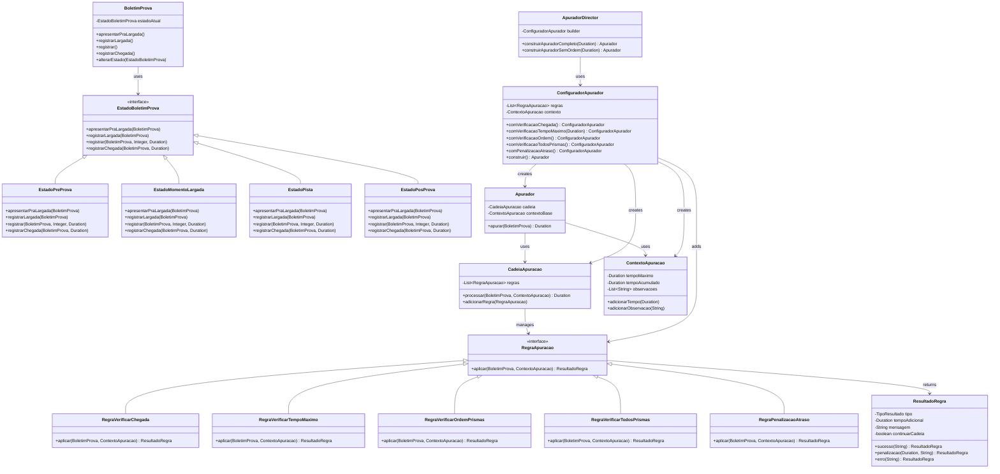

# INF011-avaliacao-III
**Terceira Avaliação da disciplina INF011 - Design Patterns**  
**Instituto Federal da Bahia (IFBA)**

## Propósito da Atividade

Esta avaliação teve como objetivo refatorar duas classes críticas do sistema de corrida de orientação aplicando padrões de projeto comportamentais e criacionais para melhorar a manutenibilidade, extensibilidade e aderência aos princípios SOLID.

---

## Padrões de Projeto Implementados

### 1. **State Pattern** (Questão 1)

#### Justificativa
A classe `BoletimProva` original continha múltiplas condicionais baseadas no atributo `fase`, violando o princípio Open/Closed e dificultando a manutenção. O padrão State foi escolhido para:
- Encapsular comportamentos específicos de cada fase da prova
- Eliminar condicionais complexas baseadas em estado
- Facilitar a adição de novos estados sem modificar código existente
- Separar claramente a lógica de cada fase

#### Classes e Responsabilidades

| Classe | Papel no Padrão | Responsabilidade |
|--------|----------------|-------------------|
| `EstadoBoletimProva` | **State (Interface)** | Define as operações que podem ser realizadas em qualquer estado |
| `EstadoPreProva` | **ConcreteState** | Implementa comportamentos da fase pré-prova (apenas apresentar para largada) |
| `EstadoMomentoLargada` | **ConcreteState** | Implementa comportamentos do momento da largada (registrar largada e atraso) |
| `EstadoPista` | **ConcreteState** | Implementa comportamentos da fase em pista (registrar passagens e chegada) |
| `EstadoPosProva` | **ConcreteState** | Implementa comportamentos pós-prova (apenas registrar atraso) |
| `BoletimProva` | **Context** | Mantém referência ao estado atual e delega operações para ele |

---

### 2. **Chain of Responsibility Pattern** (Questão 2)

#### Justificativa
A classe `Apurador` original era monolítica, com todas as regras de validação misturadas em um único método. O Chain of Responsibility foi escolhido para:
- Separar cada regra de apuração em uma classe independente
- Permitir configuração dinâmica de quais regras aplicar
- Facilitar adição/remoção de regras sem impactar outras
- Seguir o princípio Single Responsibility

#### Classes e Responsabilidades

| Classe | Papel no Padrão | Responsabilidade |
|--------|----------------|-------------------|
| `RegraApuracao` | **Handler (Interface)** | Define interface comum para todas as regras |
| `RegraVerificarChegada` | **ConcreteHandler** | Valida se o atleta registrou chegada |
| `RegraVerificarTempoMaximo` | **ConcreteHandler** | Valida se não excedeu tempo limite |
| `RegraVerificarOrdemPrismas` | **ConcreteHandler** | Valida ordem correta de passagem nos prismas |
| `RegraVerificarTodosPrismas` | **ConcreteHandler** | Valida se todos os prismas foram registrados |
| `RegraPenalizacaoAtraso` | **ConcreteHandler** | Aplica penalização por atraso na partida |
| `CadeiaApuracao` | **Client** | Gerencia a cadeia e coordena execução das regras |

---

### 3. **Builder Pattern** (Questão 2)

#### Justificativa
Para configurar diferentes tipos de apuradores de forma flexível e fluente, permitindo:
- Construção passo-a-passo de configurações complexas
- Interface clara para especificar quais regras incluir
- Flexibilidade para criar apuradores personalizados

#### Classes e Responsabilidades

| Classe | Papel no Padrão | Responsabilidade |
|--------|----------------|-------------------|
| `ConfiguradorApurador` | **Builder** | Constrói configurações de apurador passo-a-passo |
| `ContextoApuracao` | **Product** | Objeto complexo sendo construído |
| `ApuradorDirector` | **Director** | Define sequências específicas de construção para tipos comuns |
---

## Estrutura Final

### Diagrama de Classes - Padrões Implementados



### Estrutura de Arquivos

```
src/br/ifba/edu/aval/
├── model/
│   ├── BoletimProva.java (Context do State)
│   ├── Apurador.java (Refatorado para usar Chain of Responsibility)
│   ├── state/
│   │   ├── EstadoBoletimProva.java (State Interface)
│   │   ├── EstadoPreProva.java (ConcreteState)
│   │   ├── EstadoMomentoLargada.java (ConcreteState)
│   │   ├── EstadoPista.java (ConcreteState)
│   │   └── EstadoPosProva.java (ConcreteState)
│   └── apuracao/
│       ├── RegraApuracao.java (Handler Interface)
│       ├── RegraVerificarChegada.java (ConcreteHandler)
│       ├── RegraVerificarTempoMaximo.java (ConcreteHandler)
│       ├── RegraVerificarOrdemPrismas.java (ConcreteHandler)
│       ├── RegraVerificarTodosPrismas.java (ConcreteHandler)
│       ├── RegraPenalizacaoAtraso.java (ConcreteHandler)
│       ├── CadeiaApuracao.java (Chain Manager)
│       ├── ConfiguradorApurador.java (Builder)
│       ├── ApuradorDirector.java (Director)
│       ├── ContextoApuracao.java (Product)
│       └── ResultadoRegra.java (Result Object)
```
